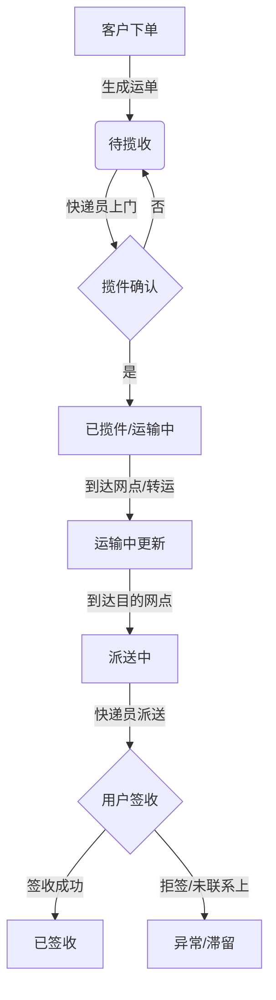
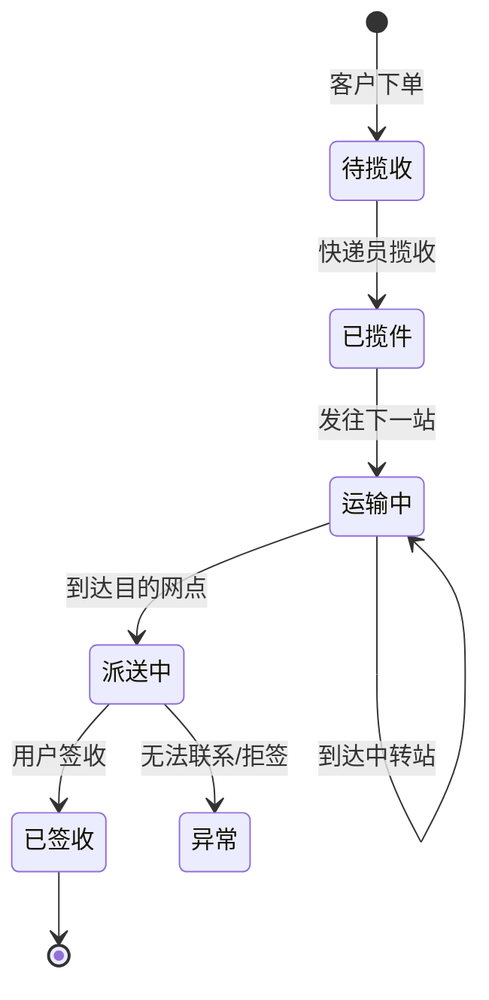

# 物流管理系统设计文档

## 1. 项目概述
本项目旨在开发一套基础的物流管理系统，
  - ORM: MyBatis / MyBatis-Plus
  - 数据库: MySQL 5.7+
- **前端**: Vue 3
  - 构建工具: Vite
  - UI 组件库: Element Plus (建议)
  - 状态管理: Pinia
  - 路由: Vue Router 4

## 3. 核心角色与权限

| 角色 | 描述 | 权限范围 |
| :--- | :--- | :--- |
| **管理员 (Admin)** | 系统最高权限管理者 | 用户管理、网点管理、运单总览、数据统计 |
| **快递员 (Courier)** | 负责具体物流操作 | 揽件录入、派送录入、签收录入、个人运单查询 |
| **客户 (Customer)** | 寄件人和收件人 | 在线下单、物流轨迹查询、个人订单管理 |

## 4. 功能模块设计

### 4.1 用户模块 (User Module)
- **登录/注册**: 支持用户名/手机号登录。
- **个人信息管理**: 修改密码、修改基本信息。
- **用户管理 (Admin)**: 新增、修改、禁用用户账号（含快递员和客户）。

### 4.2 运单模块 (Waybill Module)
这是系统的核心模块，记录包裹流转信息。

- **在线下单 (Customer)**:
  - 填写寄件人信息（姓名、电话、地址）。
  - 填写收件人信息。
  - 填写物品信息（类型、重量、体积）。
  - 系统自动生成运单号。
  
- **运单查询**:
  - 支持通过运单号、手机号查询。
  - 展示物流轨迹（时间轴）。

- **运单操作 (Courier)**:
  - **揽件**: 扫描/输入运单号，确认揽收，更新状态为“已揽件”。
  - **运输中**: 更新包裹到达某个网点或转运中心。
  - **派送**: 更新状态为“派送中”，指派派送员。
  - **签收**: 更新状态为“已签收”，记录签收人。

### 4.3 网点管理模块 (Outlet Module)
- **网点列表 (Admin)**: 展示所有营业网点。
- **网点增删改**: 管理网点名称、地址、联系电话。

### 4.4 数据统计 (Dashboard)
- **今日数据**: 今日下单量、今日揽收量、今日签收量。
- **状态分布**: 各状态（待揽收、运输中、派送中、已签收）运单数量统计。

## 5. 业务流程图 (Prototype)

### 5.1 核心业务流 (Mermaid)



### 5.2 状态机



## 6. 界面原型示意 (ASCII Mockup)

虽然无法直接生成图片，以下是核心页面的布局示意。

### 6.1 管理员仪表盘 (Admin Dashboard)

```text
+-------------------------------------------------------+
|  Logo  物流管理系统          [用户: Admin] [退出]     |
+-------------------------------------------------------+
|  [菜单栏]      |  **今日概览**                        |
|  - 首页        |                                      |
|  - 用户管理    |  [今日下单]   [今日揽收]   [今日签收]|
|  - 运单管理    |     120         105          98    |
|  - 网点管理    |                                      |
|  - 统计分析    |  ----------------------------------  |
|                |  **快捷操作**                        |
|                |  [新增网点]  [查询运单]  [添加员工]  |
|                |                                      |
|                |  **最新运单列表**                    |
|                |  ID     寄件人    收件人    状态     |
|                |  ----------------------------------  |
|                |  1001   张三      李四      运输中   |
|                |  1002   王五      赵六      待揽收   |
+----------------+--------------------------------------+
```

### 6.2 运单轨迹查询页 (Tracking Page)

```text
+-------------------------------------------------------+
|  < 返回                                               |
+-------------------------------------------------------+
|                                                       |
|   **运单号: SF1234567890**                            |
|   当前状态: 派送中                                    |
|                                                       |
|   +-----------------------------------------------+   |
|   |  (O) 2023-10-27 14:00  已签收                 |   |
|   |      签收人: 丰巢快递柜                       |   |
|   |                                               |   |
|   |  (|) 2023-10-27 09:00  派送中                 |   |
|   |      快递员: 小王 (13800138000) 正在派送      |   |
|   |                                               |   |
|   |  (|) 2023-10-26 20:00  运输中                 |   |
|   |      快件已到达 [北京朝阳集散中心]            |   |
|   |                                               |   |
|   |  (O) 2023-10-26 10:00  已揽件                 |   |
|   +-----------------------------------------------+   |
|                                                       |
+-------------------------------------------------------+
```

## 7. 数据库设计简述 (ERD)

- **User (用户表)**: id, username, password, role, phone, real_name
- **Waybill (运单表)**: id, waybill_no, sender_id, receiver_name, receiver_phone, receiver_address, current_status, create_time
- **WaybillTrack (轨迹表)**: id, waybill_id, operation_desc, operator_id, location, create_time
- **Outlet (网点表)**: id, name, address, manager_id

## 8. 下一步计划
1.  搭建 Spring Boot 后端项目骨架。
2.  搭建 Vue 3 前端项目骨架。
3.  实现用户登录功能。
4.  实现基础的运单流转功能。
